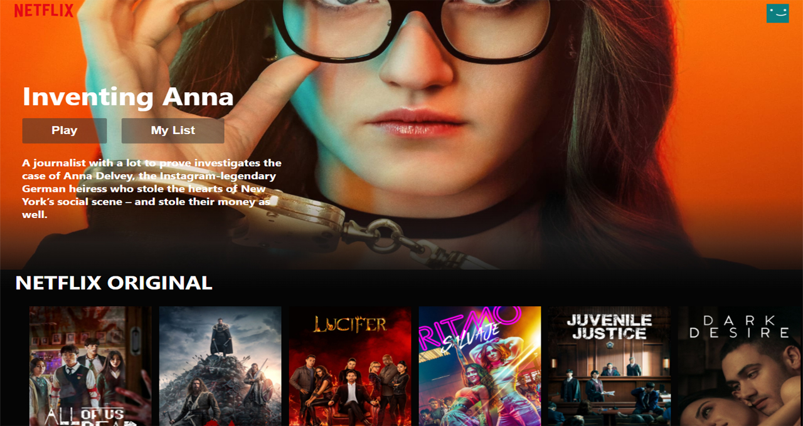

<body>
    <head>
    <h2>Welcome to my Netflix Clone</h2>
    
<i>(still in construction)</i>

     
    
This is a Netflix Clone Front-End UI React App. Responsive and without hardcoded variables.
        Within every iteration or update the movie banner is selected randomly, also every movie card has an onClick event that triggers a request and returns a Youtube video that is played below the row of the selected movie (dependency "movie-trailer" not fetching data correctly since last API update, this results in 60% of the videos not rendering, try with various clicks on different movies).
        The movies info was fetched through Axios with TMDB endpoints responding JSON.
        Used several dependencies (check package.json).

    </head>
    <section>
        
        
    </section>
</body>